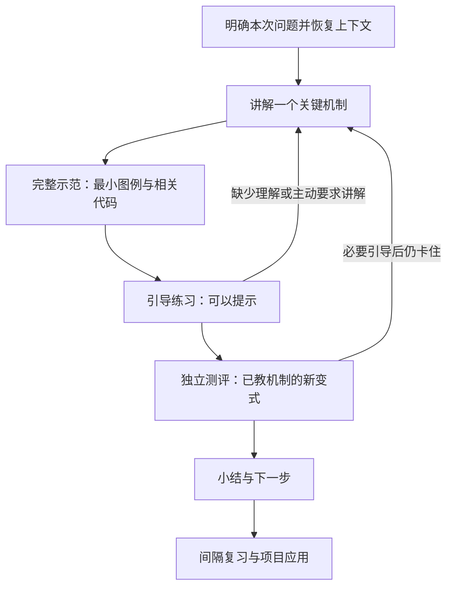

# AI Infra Learning：推理基础设施学习计划

以推理基础设施为主线，通过图例、原理讲解、源码阅读和小型实验，逐步获得独立定位问题、修改框架代码并验证结果的能力。

核心教学约定：**新知识先讲清楚、完整示范，再练习和测评；用提问检查理解，用证据判断掌握。**

## 目标与范围

- 学习背景：10 年算法工程经验，熟悉 Python、Java、TensorFlow 和推荐模型训练，能够阅读 C++，有修改 XGBoost 推理代码和提供服务的经历。
- 时间预算：24 周，每周 3–4 小时，共约 72–96 小时，包含环境准备、复习、实验和整理。
- 深入方向：PyTorch 与 vLLM 推理系统；训练方向保留整体知识地图，按项目需要补充。
- 最终产物：一个范围明确的推理框架修改，附问题复现、源码路径、设计说明和验证结果。
- 环境策略：以单卡小模型为起点，按需租用 NVIDIA GPU，记录框架版本和运行环境。

完整学习范围与阶段验收见 [curriculum.md](curriculum.md)。本文件解释设计原则，[AGENTS.md](AGENTS.md)规定教练执行流程；用户在会话中明确提出的目标和偏好优先。

## 教学方法各自解决什么问题

这些方法在不同环节配合使用。下列资料是设计参考；本项目的一对一 AI Infra 教学流程是结合个人背景与反馈做出的应用，并未经过独立效果研究。

### 1. 苏格拉底式提问：检查推理、假设和边界

通过追问理由、检视假设和比较反例，让学习者审视自己的结论。芝加哥大学法学院将其作为培养批判性思考的工具，并强调它只是多种教学方法之一。[来源：The Socratic Method](https://www.law.uchicago.edu/socratic-method)

**本课程的用法：** 在已有知识基础上的练习、故障分析和迁移题中使用，每次只问一个主要问题。例如，在已经讲清数据依赖后，要求解释某个等待操作为什么应放在消费者执行之前。

**适用边界：** 新机制由教师先讲解，不能把尚未教授的知识包装成前置题让学习者猜。正式测评答错后最多连续引导两轮，仍卡住就重新讲解；学习者主动说“不懂”“没学过”“先讲一下”时立即讲解，不必先答错。这些限制是本项目的教学约定。

### 2. 费曼式解释：用自己的语言发现理解缺口

本项目用“费曼式解释”指学习后脱离笔记，用清楚的语言向初学者解释机制，找出含糊或卡住的位置，再补充学习并重述。Caltech 教学中心的学习资源提供了类似的“通过教别人来学习”的操作流程。[来源：The Power of Teaching](https://ctlo.caltech.edu/aboutctlo/whoweserve/undergraduates/learning-resources/learning/power-of-teaching)

**本课程的用法：** 用简短复述或画图讲解，说明“它解决什么问题、为什么这样设计、什么条件下成立”。可以使用术语，但要能解释术语指向的对象和因果关系。

**适用边界：** 这里引用的是现代教学中心的学习建议，不把一套固定步骤说成费曼本人提出的标准。讲得流畅只是证据之一，还需要独立应用、代码分析或实验；不以表达是否像标准答案作为唯一评分依据。

### 3. IES 教学指南：组织示范、练习、图示与复习

参考美国教育科学研究院（IES）What Works Clearinghouse 的 2007 年指南 *Organizing Instruction and Study to Improve Student Learning*。下表证据等级沿用该版指南，不代表本课程整体已经得到同等级验证。[来源：IES 指南及建议列表](https://ies.ed.gov/ncee/wwc/PracticeGuide/1)

| 指南建议 | 该版证据等级 | 在本课程中的应用 |
|---|---|---|
| 将学习分散到不同时间 | 中等 | 对关键机制做间隔复习，按保留程度调整安排 |
| 交替使用完整解题示范和练习 | 中等 | 教师先示范，再给相似练习和独立变式 |
| 图形与语言解释结合 | 中等 | 图例配合文字说明，明确对象、箭头和变化 |
| 联系抽象与具体表示 | 中等 | 小模型 → 图示 → 地址/公式 → 真实代码 |
| 用测验重新接触关键内容 | 强 | 对已学机制做主动回忆，不只重读笔记 |
| 提出深入解释性问题 | 强 | 检查理由、因果链和适用条件 |
| 用课前问题引入新主题 | 有限 | 必要时短诊断，不把提问设为每次新课的固定开场 |

“每次最多引导两轮”“适合视觉表达的机制默认配图”“45–60 分钟学习块”等属于本项目的具体安排，不是 IES 规定的统一标准。安排是否合适，要继续依据独立作答、间隔复测和项目进展调整。

## 一次学习如何进行

开始时先读取学习状态，简短说明当前位置和推荐任务，确认本次目标。已有证据足够时不重复诊断；确需检查前置知识时，只检查直接相关的内容。

默认围绕一个关键机制安排一个完整示范、一道引导练习和一道独立检查；按实际理解调整，不机械凑题。已经熟悉的内容可以缩短讲解，复习课或明确要求直接测评时可以先提问。

| 环节 | 教师的责任 | 评分方式 |
|---|---|---|
| 讲解 | 说明问题、对象、机制和条件，直接回答解释性问题 | 不评分 |
| 示范 | 展示条件、步骤、结果及原因；把推理过程讲出来 | 不评分 |
| 引导练习 | 提供适量提示，帮助完成一个相似例子 | 不逐题评分 |
| 独立测评 | 明确标记题目，检查未直接示范过的小变式 | 保留首次独立作答结果 |
| 小结与复习 | 归纳机制和真实缺口，安排后续验证 | 依据累计证据更新掌握度 |

“测评前不公布答案”只约束测评题，不能用于拒绝讲解概念。上下文不清、要求补图或请求讲解，都不计为答错。

## 视觉讲解是默认方式

对适合视觉表达的新机制，默认至少提供一个最小图例。复杂过程优先拆成连续小图或支持前进、回退、重置的交互图，由教师先演示；不要求每张图之后都回答一道题。

| 内容 | 首选图例 |
|---|---|
| GPU 层级、框架调用链 | 分层框图、调用路径图 |
| 矩阵布局、地址和访存 | 小矩阵、地址格子、映射箭头 |
| Stream、同步、Tensor 生命周期 | 区分 CPU 提交与 GPU 执行的分泳道时间线 |
| KV Cache | 缓存块分配、增长和回收图 |
| 请求调度与批处理 | 请求队列、逐轮执行图 |
| 性能取舍 | 对照图、曲线或可调参数图 |

先用 `2×2` 或 `4×4` 模型追踪一个代表元素，每张图只解释一个重点。对象名称、坐标含义和颜色保持一致，并以文字或形状辅助区分。

涉及代码时遵循“完整相关代码 → 图示拆解 → 映射回代码位置”。说明简化模型与真实规模的对应关系；图例不替代代码上下文。示意值、预测值与实测值明确区分。简单定义或图示无法改善理解的内容可以直接用文字说明。

## 以工程证据和阶段产物推进

课程内容围绕实际任务展开：运行算子、测量现象、追踪实现、形成假设、修改代码、验证结果。一次只深入一个主要问题，达到阶段要求后前进；额外边界条件进入选修，避免基础部分无限扩张。

| 阶段 | 主题 | 主要验收产物 |
|---|---|---|
| 第 1–4 周 | GPU 必要基础与性能观察 | 可复现的计时和 profiler 分析 |
| 第 5–8 周 | PyTorch 调用链与算子 | 关键源码路径及一次小型修改 |
| 第 9–12 周 | 单卡推理服务与测量 | 启动脚本、并发对比与结果解释 |
| 第 13–16 周 | 调度、缓存与 vLLM 源码 | 一条请求路径和实际运行证据 |
| 第 17–20 周 | 训练知识地图与推理项目初版 | 最小复现、修改和验证初版 |
| 第 21–24 周 | 项目验证、整理与缓冲 | 可展示、可复现的框架修改 |

这些周数表示有效学习预算。中断后按实际证据继续，不因日历经过自动增加进度，也不要求重新学习已有合格成果。缺少 GPU 时可以推进独立的源码阅读，但不能把 CPU 模拟或口头推演标记为 GPU 验证。

## 掌握度与知识沉淀

| 等级 | 含义 |
|---|---|
| 0 | 未学习或未测试 |
| 1 | 能够识别概念 |
| 2 | 能用自己的语言解释 |
| 3 | 能够应用和分析 |
| 4 | 能够迁移、设计和排查问题 |

独立完成和提示后完成分开记录，后者不覆盖首次作答。只评价题目明确要求的内容；信心未自报时记为“未提供”。阶段完成需要对应产物，不要求每个知识点都达到 4，也不凭一次简单回答直接给高掌握度。

结束学习时检查可复用知识：满足独立解释、应用验证、可靠依据等条件的内容整理为 canonical；尚有验证缺口的内容保留为 candidate，并记录后续任务；没有知识增量时明确说明原因。现行具体条件见 [AGENTS.md](AGENTS.md)。

聊天记录不直接等于正式知识；预测不等于实测；答对一道题不等于完成一个阶段。

## 在 Obsidian 中阅读知识

将本仓库根目录作为 Obsidian vault。知识卡按以下规范沉淀，具体要求见 [AGENTS.md](AGENTS.md) 的“Obsidian 阅读与排版规范”，模板见 [templates/knowledge-card.md](templates/knowledge-card.md)。

- **知识跳转**：内部关联使用 `[[knowledge/canonical/gpu-execution-hierarchy|GPU 执行层级]]` 形式的 wikilink，支持真实章节定位；前置知识、相关概念与 session 证据形成可导航的关系。外部资料仍用普通网页链接。
- **原生数学**：使用 `$...$` 行内公式和 `$$...$$` 独立公式，交给 Obsidian 的 MathJax 渲染；公式配套假设、符号、单位与最小例子。
- **美观图形**：优先 Mermaid；需要精确布局时嵌入 vault 内 SVG/PNG。保持清晰层级、统一语义、适量配色和充足间距，正常笔记宽度及明暗主题下可读。
- **独立阅读**：聊天交互图补成可在笔记内直接阅读的关键步骤图，不依赖聊天专属渲染或临时文件。
- **检查与迁移**：新建/修订卡片检查链接、公式和图形，能访问 Obsidian 时实际预览；不能预览时明确说明。旧卡片随对应主题重学逐步迁移，历史证据保留。

原生语法参考：[Obsidian 内部链接](https://obsidian.md/help/links)、[数学与图形](https://obsidian.md/help/advanced-syntax)。图形审美与验收细节是本项目的要求。

## 仓库入口

| 文件或目录 | 用途 |
|---|---|
| [AGENTS.md](AGENTS.md) | 教学、测评、保存和 Git 操作规则 |
| [curriculum.md](curriculum.md) | 课程主线、选修和阶段验收 |
| [state/current.md](state/current.md) | 当前目标、教学偏好和下一步 |
| [inbox.md](inbox.md) | 提前记录的学习需求 |
| [state/mastery.md](state/mastery.md) | 掌握度和证据 |
| [state/mistakes.md](state/mistakes.md)、[state/review-queue.md](state/review-queue.md) | 薄弱点和复习任务 |
| [state/answer-history.csv](state/answer-history.csv)、[sessions/](sessions/) | 正式测评记录和学习摘要 |
| [knowledge/canonical/](knowledge/canonical/)、[knowledge/candidates/](knowledge/candidates/) | 正式知识与待验证知识 |
| [examples/](examples/)、[templates/](templates/) | 示例代码与记录模板 |
| [weekly-reviews/](weekly-reviews/) | 周期复盘和历史计划 |

当前学习安排以 `state/current.md` 和 `curriculum.md` 为准，旧 session 和周报保留为历史记录。本表描述现有目录，不代表此前讨论的文件合并方案已经全部实施。

## 如何使用

| 对教练说 | 预期行为 |
|---|---|
| “开始学习” | 读取进度、推荐任务，确认目标后开始 |
| “先讲一下”或“画图解释” | 立即进入讲解或视觉拆解，不算答错 |
| “直接测我” | 对已学内容进入独立测评 |
| “结束学习”或“保存进度” | 保存状态、摘要和知识增量，不自动提交或推送 |
| “提交并结束学习” | 保存并检查，只提交本次学习相关文件，不推送 |
| “提交并同步，结束学习” | 保存、检查、提交，并在核对分支与远端后同步；失败时停止，不强推 |

设计依据核验日期：2026-09-13。教学效果持续通过学习者反馈、独立表现和工程产物检验。
