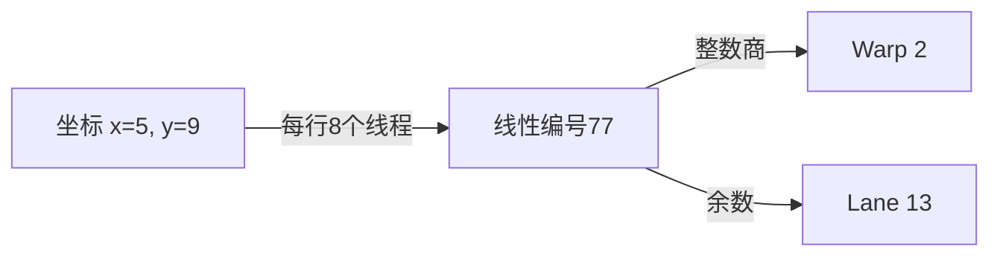

# 二维线程坐标到 Warp 与 Lane

> [!abstract] 当前候选结论
> CUDA 在一个 Block 内按 x 先变化的顺序把二维坐标转为线性编号，再按每 32 个线程划分 Warp。线性编号除以 32 的整数商是本文的 Block 内逻辑 Warp 编号，余数是 Lane。

## 它解决什么问题

处理矩阵时，二维坐标便于描述线程负责的位置；判断哪些线程属于同一个 Warp，需要先获得 Block 内线性编号。这里描述逻辑线程分组，不描述物理核心位置或执行时间顺序。

## 前置知识

- [[knowledge/canonical/gpu-execution-hierarchy|GPU 执行层级]]：Warp 不跨 Block，Lane 从 0 开始。
- 整数除法的商与余数；行列坐标均从 0 开始。

## 核心机制

一个二维 Block 的 x 方向大小为 $D_x$，y 方向大小为 $D_y$。坐标满足 $0\leq x<D_x$、$0\leq y<D_y$，z 方向只有一层。

$$
t=yD_x+x
$$

$t$ 是 Block 内线性线程编号；$y$ 表示前面有多少整行，每行 $D_x$ 个线程；$x$ 是本行偏移。各量均为无量纲整数。总行数 $D_y$ 决定坐标范围，不是每行的宽度。

在 NVIDIA CUDA 的 32 线程 Warp 模型下：

$$
w=\left\lfloor\frac{t}{32}\right\rfloor
$$

$$
\ell=t-32w
$$

$w$ 是本文按连续线程分组定义的 Block 内逻辑 Warp 编号，$\ell$ 是 Lane，范围为 0～31。

## 最小图例与完整示范

下面是 4 列、3 行的 Block。横向 x 向右增加，纵向 y 向下增加；每个格子写线性编号，强调目标坐标 $(2,1)$。

| y / x | 0 | 1 | 2 | 3 |
|---|---:|---:|---:|---:|
| 0 | 0 | 1 | 2 | 3 |
| 1 | 4 | 5 | **6** | 7 |
| 2 | 8 | 9 | 10 | 11 |

图注：前面一行占 4 个位置，再偏移 2 个位置，因此 $t=1\times4+2=6$；编号排列不表示执行先后。

扩大到 8 列、12 行的 Block，追踪 $(x,y)=(5,9)$：

$$
\begin{aligned}
t&=9\times8+5=77\\
77&=2\times32+13
\end{aligned}
$$

因此逻辑 Warp 编号为 2，Lane 为 13。

图注：箭头表示编号换算，不是数据移动或调度顺序。一个 Warp 可以跨越同一 Block 内的多行，因此 Lane 不一定等于 x。

## 与代码的对应

在 CUDA C++ 中，x、y 分别来自 `threadIdx.x`、`threadIdx.y`，每行线程数来自 `blockDim.x`。本卡是概念推导，未新增二维 CUDA kernel，也未进行 GPU 编译或实测。Block 内编号不自动等于整个矩阵的全局元素地址。

## 掌握证据

- [[sessions/2026-09-15-thread-index-relearning#二维线性编号独立测评与 Evaluation|二维编号复测]]：6 列条件下独立写出 $2\times6+4=16$；之前换题时曾沿用上一题行宽。
- [[sessions/2026-09-15-thread-index-relearning#二维 Warp 与 Lane 独立测评与 Evaluation|组合映射复测]]：独立回答 77、2、13；题目要求的算式由教师补充，不能算用户独立推导证据。此前编号 50 的 Warp 经提示后由 2 修正为 1。
- 历史 [[state/answer-history.csv|答题记录]] 中有 2026-08-14 的二维计算证据；本轮保留历史表现，不用它覆盖当前误差。

## 尚未进入 Canonical 的原因

已有独立应用和官方依据，但本轮主要是算式与数值作答，还缺少脱离提示、用自己的语言解释“为什么乘每行线程数、为什么 x 不总等于 Lane”的证据。此状态表示掌握证据缺口，不表示 CUDA 规则尚无依据。

## 转入 Canonical 的条件

1. 在间隔复习中，不看公式解释行宽与总行数的区别，以及整数商、余数分别代表什么。
2. 对一个新的合法 Block 形状，独立完成坐标到 Warp/Lane 的应用并说明依据。
3. 合并至 [[knowledge/canonical/gpu-execution-hierarchy|GPU 执行层级]]，本候选卡标记已提升并保留演进记录。

任务已加入 [[state/review-queue|复习队列]]。基础计算已通过，不阻塞下一课 Warp 内分支。

## 参考资料与验证

- [NVIDIA CUDA 12.6 Thread Hierarchy](https://docs.nvidia.com/cuda/archive/12.6.0/cuda-c-programming-guide/index.html#thread-hierarchy)：二维线程线性编号规则。
- [NVIDIA Advanced Kernel Programming](https://docs.nvidia.com/cuda/cuda-programming-guide/03-advanced/advanced-kernel-programming.html)：Block 内连续线程划分 Warp。
- 本轮仅完成静态语法、路径和编号推导检查；未在 Obsidian 实际预览。
