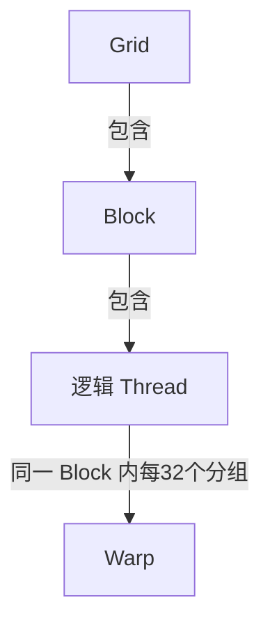
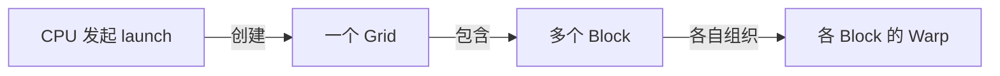

# GPU Execution Hierarchy

- Status: 正式知识
- 历史证据：[[sessions/2026-08-01-gpu-execution-model|首次学习]]、[[sessions/2026-08-03-gpu-hierarchy-review|层级复习]]
- 历史验证日期：2026-08-03；2026-09-15 补充编号与分组证据，未重验其余全部主题。

## 一句话定义

一次 GPU kernel launch 创建一个 Grid；Grid 由多个 Block 组成，Block 包含多个 Thread，而 NVIDIA GPU 会在每个 Block 内把 Thread 按通常 32 个一组组织成 Warp 执行。

## 它解决什么问题

这套层级让同一个 kernel 扩展到大量数据：每个 Thread 处理一小份工作，Block 提供局部协作边界，Grid 表示一次 launch 的完整工作范围。

## 前置知识

- [[knowledge/canonical/cuda-streams-events-and-timing|CPU 提交与 GPU 异步执行]]：提交和完成是不同事件。
- Kernel 是由大量 GPU Thread 执行的函数。
- 本卡索引公式限定一维 launch；二维扩展见 [[knowledge/candidates/2d-thread-warp-lane-mapping|二维编号候选卡]]。

## 核心机制

### Grid、Block、Thread

- Grid：一次 kernel launch 创建的全部 Thread 集合。
- Block：Grid 的分块，是 shared memory 和局部同步的重要边界。
- Thread：kernel 的一个逻辑执行实例，通过索引选择要处理的数据；每个 Thread 有自己的 `threadIdx` 和逻辑执行状态。

程序员直接指定 Grid 和 Block 的维度，由此确定 Thread 数量。

### Warp

Warp 是 NVIDIA GPU 的硬件执行分组，不是程序员在 Grid 与 Block 之间额外创建的对象。同一 Block 内连续的 Thread 通常每 32 个组成一个 Warp。

Warp 不能跨 Block 组合。若一个 Block 有 48 个 Thread，硬件仍形成两个 32-lane Warp：第一个有 32 个有效 Thread，第二个只有 16 个有效 Thread，而不是创建一个“16 Thread 的 Warp”。

准确的关系是：

图注：箭头表示包含或分组关系，不表示执行先后；Warp 不是额外创建的一批 Thread。

### Block 同步边界

同一 Block 内的 Thread 可以通过 `__syncthreads()` 建立屏障。不同 Block 可能位于不同 SM，也不能假设执行先后顺序，因此普通 kernel 中不能用 `__syncthreads()` 跨 Block 同步。

一个 Block 在执行期间驻留于一个 SM。Grid 中的 Block 数可能远多于 GPU 同时可驻留的 Block 数；如果已驻留 Block 等待尚未被调度的 Block，已驻留 Block 不释放资源，剩余 Block 又无法运行，可能形成死锁。这也是普通 kernel 不提供全 Grid 屏障的重要原因。

### Warp Divergence

同一 Warp 内的 Thread 选择不同控制流路径时，会产生 Warp Divergence。GPU 需要分别执行各条路径，并暂时屏蔽不走当前路径的 Thread；结果可以保持正确，但资源利用率可能下降。

只有同一个 Warp 内发生路径分裂才构成这一问题。若分支边界与 Warp 边界对齐，每个 Warp 内部仍走统一路径，就不会产生对应的分支发散。

## 系统流程

图注：第一条箭头表示提交，其余表示工作组织，不表示 CPU 等待 GPU 完成或 Block 顺序执行。

## 复杂度与性能影响

- 对每线程只处理一个元素的简单映射，线程数需覆盖数据规模，超出的 Thread 必须经过边界检查；循环处理多个元素的 kernel 不受这一对一假设限制。
- Thread 数不是 32 的整数倍时，最后一个 Warp 可能只有部分有效 Thread。
- 同一 Warp 内的分支发散会降低执行资源利用率。
- Warp 不会跨 Block 拼接，因此两个各含 16 个 Thread 的 Block 会各自形成一个部分有效的 Warp。

## 数学表达与最小示例

限定一维 Grid、一维 Block，每个 Block 有相同的 $T>0$ 个线程。采用每线程处理一个元素、各 Block 连续分段的映射，编号从 0 开始：

$$
i=bT+t
$$

$b$ 为 Block 编号，$t$ 为 Block 内线程编号，$i$ 为本例负责的全局元素编号，均为无量纲整数。Block 2、每 Block 4 线程、局部编号 1 时，$i=2\times4+1=9$。

NVIDIA CUDA 使用 32 线程的 Warp。本文按 Block 内连续线程分组定义逻辑 Warp 编号 $w$ 和 Lane $\ell$：

$$
w=\left\lfloor\frac{t}{32}\right\rfloor,\qquad \ell=t-32w
$$

例如 $t=83=2\times32+19$，因此 $w=2$、$\ell=19$。第 3 组的编号是 2；Lane 是 Warp 内位置，不是物理核心编号。

每个 Block 所需的 Warp 数为：

$$
N_{\mathrm{warp,block}}=\left\lceil\frac{T}{32}\right\rceil
$$

一个 Block 有 70 线程时，分为 32、32、6，共 3 个 Warp，逻辑线程仍是 70 个。尾 Warp 的未使用位置与额外启动线程后跳过数据操作是两回事。

| 相同总线程数的两种组织 | 每 Block 的 Warp 数 | 总 Warp 数 |
|---|---:|---:|
| 1 个 Block，每个 64 线程 | 2 | 2 |
| 4 个 Block，每个 16 线程 | 1 | 4 |

图表重点：各 Block 内分别计数，再求和，不能把不同 Block 的空缺位置拼满。

另一个逐元素映射示例：处理 1000 个元素、每 Block 256 线程，需要 4 个 Block，共启动 1024 个真实逻辑线程，最后 24 个由边界检查跳过数据操作。

## 常见误解

- Warp 不是程序员显式 launch 的层级，而是硬件对 Block 内 Thread 的执行分组。
- 所有 Thread 本来就运行同一份 kernel 代码；Warp Divergence 讨论的是同一 Warp 内是否选择不同控制流路径。
- `__syncthreads()` 只能同步同一 Block 内的 Thread。
- 多启动的 Thread 不能直接访问超出数据范围的元素，必须做边界检查。
- Thread 数决定逻辑执行实例数；Warp 数只描述硬件如何把这些 Thread 成组执行。例如 256 个 Thread 是 256 个逻辑实例，而不是 8 个逻辑实例。

## 与相关技术的区别

- Grid、Block、Thread 属于 CUDA 编程模型。
- Warp 属于 NVIDIA GPU 执行模型。
- Block 是协作和同步边界；Warp 是硬件发射与执行线程的分组。

### 与 LLM Serving 请求的区别

用户请求属于 serving scheduler 的逻辑层；Grid、Block、Thread、Warp 属于 kernel 执行层。一个用户的一次 Decode step 会经过许多 kernel/Grid，而一个 batched Grid 也可能处理多个用户的数据，因此两者通常是多对多关系，不能固定映射为“一用户一 Warp/Block/Grid”。

## 代码或实验

完整的一维教学实现见 [[examples/cuda/thread_block_grid.cu|逐元素加10源码]]：`add_ten` 显式计算 Block 起点与全局索引，`launch_add_ten` 配置每 Block 4 线程，`main` 提供内存准备、同步和输出校验。

本轮仅核对索引和预期输出；本机无 nvcc，未进行该示例的 CUDA 编译和 GPU 执行。历史其他主题的 GPU 实验不能替代本示例验证。

## 我曾经答错的地方

- 曾把 256 个 Thread 组成的 8 个 Warp 误答为“8 个逻辑执行实例”。
- 纠正后能说明：逻辑实例数由 Thread 数决定，Warp 是硬件对 Thread 的执行分组。

## 掌握证据

- 正确计算 Thread、Warp 和空闲 Thread 数量。
- 正确使用 `blockIdx.x * blockDim.x + threadIdx.x` 计算全局索引。
- 正确判断简单的 Warp Divergence。
- 正确指出不同 Block 不能通过 `__syncthreads()` 同步。
- 能用自己的语言复述 Grid、Block、Warp、Thread 的关系。
- 正确判断部分有效 Warp、Warp 不跨 Block，以及跨 Block 等待可能造成的调度死锁。
- 能将执行模型迁移到 LLM serving，解释用户请求与 Grid/Warp 的多对多关系。

## 待验证内容

### 本轮补充证据与后续验证

[[sessions/2026-09-15-thread-index-relearning|2026-09-15 编号与分组复习]] 中，独立计算全局编号9、Thread105的Warp3、Thread83的Lane19；独立解释70线程的尾Warp未填满，以及64线程两种Block布局的Warp数分别为2和4。

Warp 编号曾混淆“第几组”和零基编号；提示后修正与新题独立复测分别保存。整体掌握度保持3，不把简单计算等同于调试能力。历史分支和同步内容待 R2 后续重验。

二维换算已通过基本计算复测，但独立解释证据仍待补，见 [[knowledge/candidates/2d-thread-warp-lane-mapping|二维编号候选卡]]。

- Occupancy、寄存器和 shared memory 如何共同限制 SM 上的驻留 Block/Warp 数量。

## 参考资料

- [NVIDIA CUDA 12.6 Thread Hierarchy](https://docs.nvidia.com/cuda/archive/12.6.0/cuda-c-programming-guide/index.html#thread-hierarchy)：层级与索引规则。
- [NVIDIA Advanced Kernel Programming](https://docs.nvidia.com/cuda/cuda-programming-guide/03-advanced/advanced-kernel-programming.html)：Warp 分组与执行机制。
- 本轮新增公式、Mermaid 和 wikilink 做静态检查；未在 Obsidian 实际预览。
