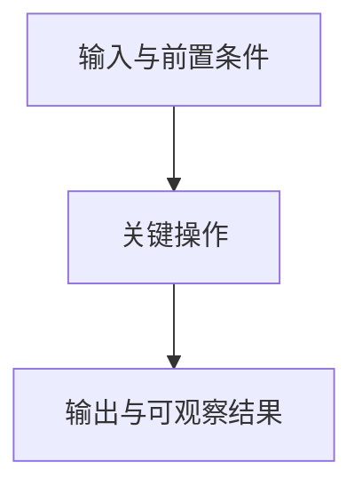

# 知识点名称

<!-- 复制模板后填写真实标题、别名、日期和状态；canonical / candidate / promoted 依据证据填写。删除不适用小节和模板提示，避免空标题。 -->

> [!abstract] 核心结论
> 用一两句话说明机制与成立条件，不只重复术语定义。

## 一句话定义

## 它解决什么问题

## 前置知识

<!-- 用真实存在的 wikilink 关联前置知识，并简述本卡需要它的哪一部分。
语法示例：[[knowledge/canonical/gpu-execution-hierarchy|GPU 执行层级]]。
缺少对应笔记时标记“待补充”，不要创建假链接。 -->

## 核心机制

## 系统流程

<!-- 优先 Mermaid；以下只是流程模板，必须替换为本主题的真实对象和关系。图注说明箭头含义。复杂流程分图，正常阅读宽度下保持清楚。 -->

图注：填写本图要表达的关系、顺序及简化条件。

## 数学表达与推导

<!-- 仅在需要时保留。行内公式用 $...$，独立公式用 $$ 包围；不使用截图或代码块代替原生数学。先写假设，再写公式，最后解释符号、单位和代入结果。
语法示例（应替换为本主题公式）：

$$
t_{\mathrm{wait}} = \max(0,\,t_{\mathrm{done}} - t_{\mathrm{call}})
$$

该例需要明确：done 对应同步范围内的完成时刻，call 为调用时刻，使用相同时间单位并忽略调用开销。
-->

## 复杂度与性能影响

## 最小示例

## 常见误解

## 与相关技术的区别

## 相关知识

<!-- 使用 [[vault内路径|中文显示名]]，说明各链接与本主题的关系。需要定位时使用 [[vault内路径#真实标题|显示名]]。避免只列一串链接。 -->

## 代码或实验

<!-- 给出完整相关代码和可定位的源码/示例路径；记录环境、版本、运行命令、观察与限制。预测结果和实际结果分开。代码附件链接保留扩展名；数学索引用原生公式解释。 -->

## 我曾经答错的地方

## 掌握证据

<!-- 使用 [[sessions/实际会话文件名|日期与主题]] 链接真实记录。分别记录独立完成、提示后完成和实机证据，不因格式迁移修改历史评价。 -->

## 待验证内容

<!-- candidate 必须说明未进入 canonical 的具体原因、已有证据、尚需验证的任务和可检查的转入条件；同步维护 review queue。 -->

## 参考资料

<!-- 外部资料使用普通 Markdown 链接；引用应紧邻关键结论或标明支持的具体机制。完成前检查 wikilink、公式和图形，并在可用的 Obsidian 阅读模式中预览。 -->
